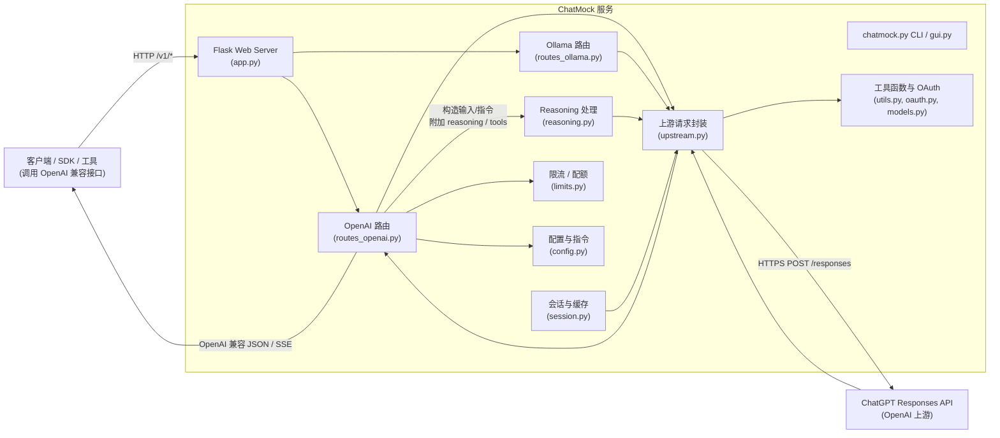
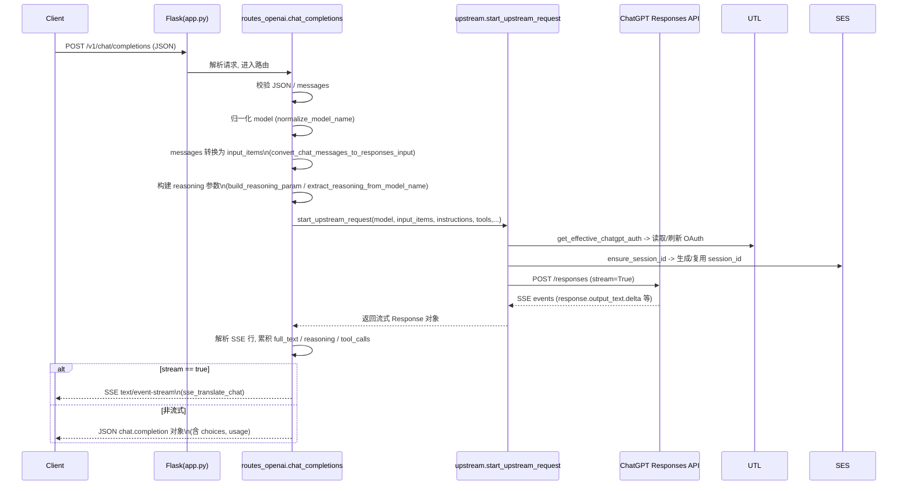
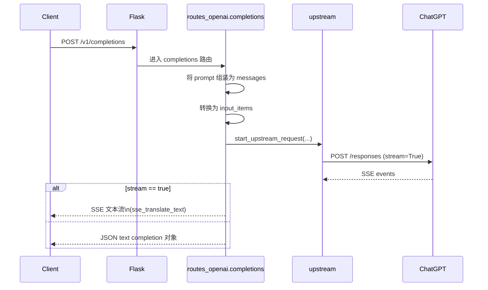
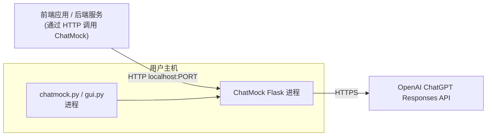

# ChatMock 架构设计

## 1. 总体概览

ChatMock 是一个基于 Flask 的轻量级 "OpenAI 接口代理"，通过本地登录 ChatGPT 账号，将标准 OpenAI API 请求（/v1/chat/completions、/v1/completions 等）转换为 ChatGPT Responses API 调用，并将 SSE 流式结果再转换回 OpenAI 兼容格式返回。

其核心目标：
- **接口兼容**：对前端或其他服务暴露与 OpenAI 官方尽量一致的 HTTP 接口和 JSON 结构。
- **本地代理**：在本地持有 ChatGPT OAuth 凭据，统一转发到 ChatGPT Responses API。
- **可观测性与扩展**：对请求/响应进行必要的转换、日志和限流控制，并支持 reasoning、web_search 等高级能力。

### 1.1 高层组件图

## 2. 请求与数据流

### 2.1 /v1/chat/completions 数据流

### 2.2 /v1/completions 数据流

### 2.3 Responses SSE 事件到 OpenAI 格式的映射

`utils.sse_translate_chat` / `utils.sse_translate_text` / `routes_openai.chat_completions` 中完成以下映射：
- `response.output_text.delta` → OpenAI `choices[].delta.content` 或最终 `message.content`。
- `response.reasoning_summary_text.delta` / `response.reasoning_text.delta` → 根据 `reasoning_compat` 注入到思维标签或自定义字段。
- `response.output_item.done` + `type == function_call` → OpenAI `tool_calls` 或 `function_call` 结构。
- `response.failed` / `response.completed` → 控制 SSE 结束与错误返回。

## 3. 核心模块设计

### 3.1 应用入口与配置

- `chatmock/app.py`
  - **职责**：
    - 构建 Flask 应用实例。
    - 装载运行时配置（verbose、reasoning_*、debug_model、DEFAULT_WEB_SEARCH 等）。
    - 注册路由蓝图 `openai_bp`、`ollama_bp`。
    - 提供 `/` 和 `/health` 健康检查。
    - 在 `after_request` 中附加统一的 CORS 头（通过 `build_cors_headers`）。
  - **关键点**：
    - 所有业务逻辑都在蓝图内部；`create_app` 只做组合和配置注入。

- `chatmock/config.py`
  - **职责**：
    - 定义 `BASE_INSTRUCTIONS` 和 `GPT5_CODEX_INSTRUCTIONS` 等系统级提示词，
      在 `_instructions_for_model` 中根据模型选择不同的系统指令。
    - 持有上游 API 地址 `CHATGPT_RESPONSES_URL`、OAuth 配置、CLIENT_ID 等常量。

- `chatmock/cli.py`、`chatmock.py`、`gui.py`
  - **职责**：
    - 命令行/GUI 启动入口，调用 `create_app` 启动 HTTP 服务。
    - 提供 `login` 等命令，完成本地 OAuth 授权并写入 `auth.json`。

### 3.2 OpenAI 兼容路由层

- `chatmock/routes_openai.py`
  - **主要路由**：
    - `POST /v1/chat/completions` → `chat_completions`
    - `POST /v1/completions` → `completions`
  - **职责与处理流程（chat_completions）**：
    - **请求解析与校验**：
      - 从 `request.get_data` 读取原始 JSON 字符串，
        包含容错处理（换行、回车清洗后再次尝试解析）。
      - 统一将 `prompt` / `input` 转为 `messages` 列表，对缺失字段进行合理默认。
      - 若存在 `role == system` 的 message，将其内容移入首条 user message，以更好适配 Responses API。
    - **Streaming 与 usage 控制**：
      - 支持 `stream` 和 `stream_options.include_usage`，在 SSE 事件中聚合 usage，最终附加到响应。
    - **Tool / web_search 支持**：
      - `convert_tools_chat_to_responses` 转换 OpenAI tools。
      - `responses_tools` / `responses_tool_choice` 解析 web_search 等扩展工具，并限制 payload 大小。
      - 若上游拒绝 tools（包含 web_search），自动 fallback 到仅基础 tools + BASE_INSTRUCTIONS 的请求。
    - **Reasoning 支持**：
      - 从模型名提取 reasoning 维度（如 `gpt-5.1-codex-high`），再与 payload 中的 `reasoning` 字段合并。
      - 构造 `reasoning_param` 传入 `start_upstream_request`。
    - **SSE 解析与重组**：
      - 从 Responses SSE 中抽取 `full_text`、`reasoning_summary_text`、`reasoning_full_text`、`tool_calls`、`usage` 等。
      - 若非流式，将这些字段封装为 OpenAI `chat.completion` JSON 对象返回。
      - 将 reasoning 文本通过 `apply_reasoning_to_message` 注入到最终 `message`。

  - **职责与处理流程（completions）**：
    - 兼容传统 text completion 调用，将 `prompt` 折叠/拼接后转换成单一 user message。
    - 转换为 Responses `input_items` 后调用 `start_upstream_request`。
    - 使用 `sse_translate_text`/自定义解析聚合 SSE 文本并返回 OpenAI `text completion`。

### 3.3 Ollama 路由层

- `chatmock/routes_ollama.py`
  - **职责**：
    - 暴露兼容 Ollama 的 HTTP 接口，将请求转为上游模型调用或本地推理（视实现而定）。
    - 与 `routes_openai` 类似，负责解析请求、构造上游输入、以 SSE 或非流式形式返回。

### 3.4 上游访问与会话管理

- `chatmock/upstream.py`
  - **normalize_model_name(name, debug_model)**：
    - 处理 `gpt5` / `gpt-5-latest` / `gpt5.1-codex-high` 等别名与后缀（reasoning effort 形如 `-high`）。
    - 返回标准化模型名 `gpt-5`、`gpt-5.1`、`gpt-5-codex` 等。
  - **start_upstream_request(...)**：
    - 使用 `get_effective_chatgpt_auth` 获取 access_token、account_id，若缺失则返回 401，提示需要 `python3 chatmock.py login`。
    - 调用 `ensure_session_id` 生成/复用会话 ID（用于 prompt cache key 与 header `session_id`）。
    - 构造 Responses API 请求体：
      - `model`、`instructions`、`input`、`tools`、`tool_choice`、`parallel_tool_calls`、`store`(false)、`stream`(true)、`prompt_cache_key` 等。
      - 若启用 reasoning，则设置 `include=["reasoning.encrypted_content"]` 与 `responses_payload["reasoning"]`。
    - 使用 `requests.post(..., stream=True)` 连接上游，失败时包装为统一 JSON 错误并附加 CORS 头。
    - 在 `upstream` Response 对象上挂载 `_chatmock_request_ctx` 以便后续调试/日志。

- `chatmock/session.py`
  - **canonicalize_prefix(instructions, input_items)**：
    - 提取稳定的前缀（系统指令 + 第一条 user message 内容），并进行 JSON 规范化，以便生成指纹。
  - **ensure_session_id(...)**：
    - 若客户端在 header 中提供 `X-Session-Id` 或 `session_id`，则直接使用。
    - 否则根据规范化前缀计算 SHA256 指纹，维护一个有限大小的 LRU 字典 `_FINGERPRINT_TO_UUID`，为相同前缀复用 UUID 型 session_id。
    - 该 session_id 同时用作 Responses 请求体中的 `prompt_cache_key`。

### 3.5 工具函数与 OAuth 支撑

- `chatmock/utils.py`
  - **认证与配置存储**：
    - `get_home_dir` / `read_auth_file` / `write_auth_file`：读写 `~/.chatgpt-local/auth.json` 或 `~/.codex/auth.json`。
    - `load_chatgpt_tokens`：在必要时自动刷新 access_token，并持久化更新后的 tokens。
  - **OAuth 辅助**：
    - `generate_pkce`：生成 PKCE code_verifier/code_challenge。
  - **消息/工具转换**：
    - `convert_chat_messages_to_responses_input`：
      - 过滤 system、tool、assistant tool_calls 等不同角色。
      - 将 OpenAI `messages` 转为 Responses 的 `input_items`，支持文本与多模态图片（`input_image`）。
    - `convert_tools_chat_to_responses`：
      - 将 OpenAI 风格 tools 描述转换为 Responses 的 `tools` 数组（type=function, name, parameters, strict=false）。
  - **SSE 翻译**（部分函数位于本文件）：
    - 负责从上游 SSE 流中解析事件，翻译为 OpenAI 兼容的 SSE 或一次性 JSON 响应结构。

- `chatmock/oauth.py`、`chatmock/models.py`
  - **职责**：
    - 定义 OAuth 相关 Pydantic/数据模型（如 `PkceCodes`）。
    - 提供登录、回调处理、token 解析与存储等工具。

### 3.6 Reasoning 模块

- `chatmock/reasoning.py`
  - **extract_reasoning_from_model_name(model_name)**：
    - 从模型名后缀中推断 reasoning effort（minimal/low/medium/high 等）。
  - **build_reasoning_param(effort, summary, overrides)**：
    - 将全局配置与请求级配置合并成 Responses `reasoning` 字段。
  - **apply_reasoning_to_message(message, summary_text, full_text, compat)**：
    - 根据 `compat` 策略将 reasoning 文本注入到最终返回给客户端的 message。
    - 例如：包裹在 `<think>` 标签中，或写入自定义元字段。

### 3.7 限流与 HTTP 辅助

- `chatmock/limits.py`
  - **record_rate_limits_from_response(upstream)**：
    - 从上游响应头中读取速率限制信息（如剩余配额、重置时间），并在本地进行记录或暴露，以便后续可观测性或限流逻辑使用。

- `chatmock/http.py`
  - **build_cors_headers()**：
    - 构造统一的 CORS 头（如 `Access-Control-Allow-Origin`, `Access-Control-Allow-Headers`, `Access-Control-Allow-Methods`）。
    - 在 `app.after_request` 中应用到所有响应。

## 4. 部署与运行架构

### 4.1 进程与部署拓扑

- 通常在本地通过 `python chatmock.py serve` 或 Docker 启动 Flask 服务。
- 默认在同一主机上，Flask 进程通过 OAuth 凭据与 OpenAI 云交互。

### 4.2 配置与安全

- OAuth 凭据保存在用户 home 目录下的 `auth.json`，文件权限设为 `600`。
- 通过环境变量（如 `CHATGPT_LOCAL_HOME`、`CODEX_HOME`）控制凭据目录位置。
- 上游访问使用 `https` 与 Bearer Token，session_id 不包含敏感内容，仅为 UUID 或缓存 key。

## 5. 扩展与演进方向

- **扩展模型/路由**：
  - 在 `routes_openai.py` 中增加更多 OpenAI 兼容端点（如 `/v1/embeddings`），在 `upstream.py` 中统一接入 Responses 或其他上游。
- **更丰富的工具与 web_search**：
  - 扩展 `responses_tools` 解析逻辑，支持自定义的工具类型及更复杂的参数结构。
- **限流与多租户**：
  - 在 `limits.py` 基础上实现本地限流、配额统计，以及对不同 account_id / client_session_id 的隔离。
- **观测性与调试**：
  - 标准化 `_chatmock_request_ctx`，将上游请求上下文通过日志或调试接口暴露出来，便于追踪问题。

以上就是 ChatMock 当前实现所对应的架构设计与数据流说明，可随着代码演进同步更新本文件。